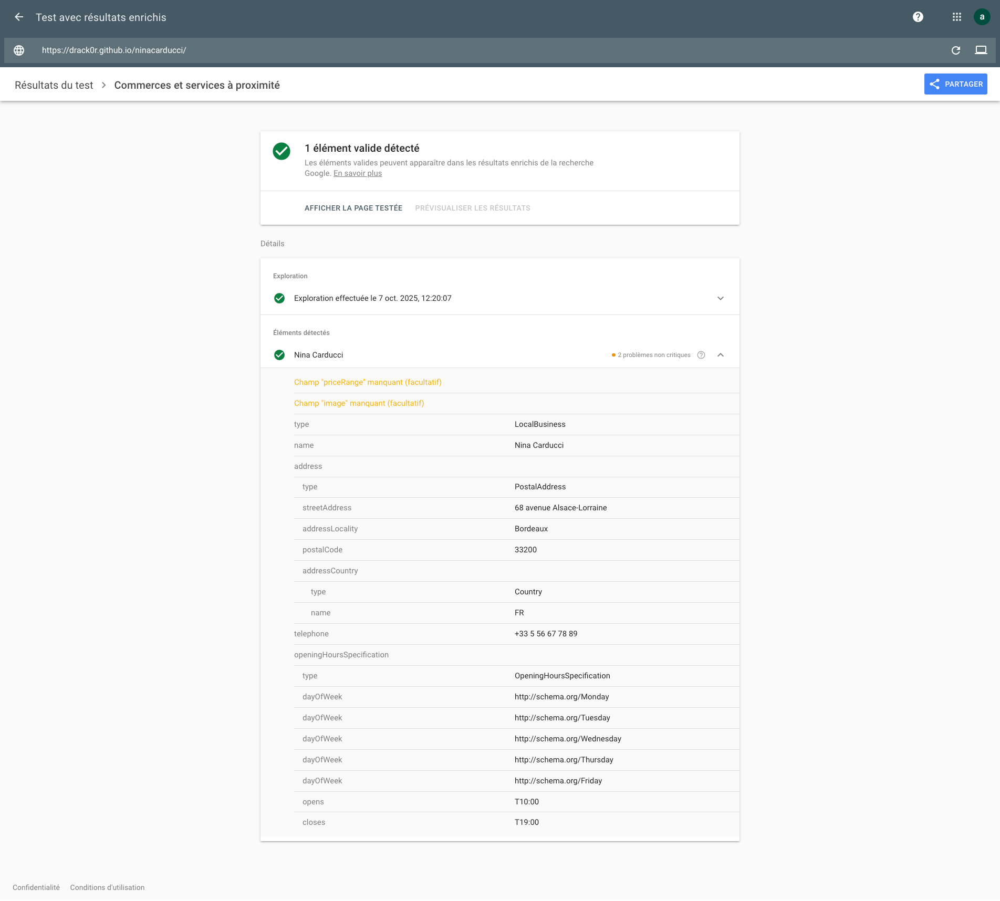
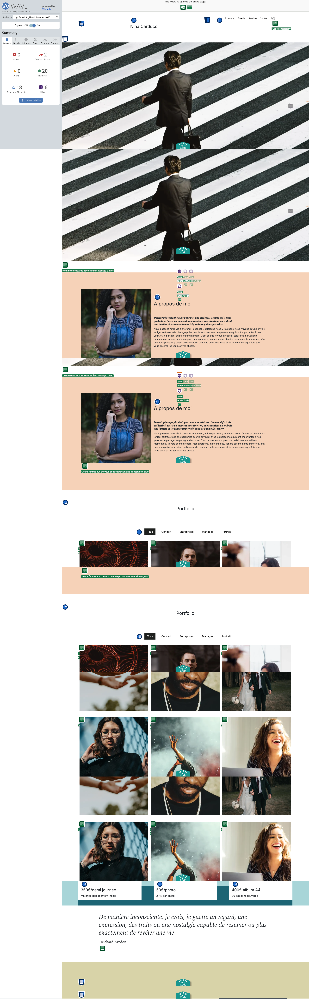
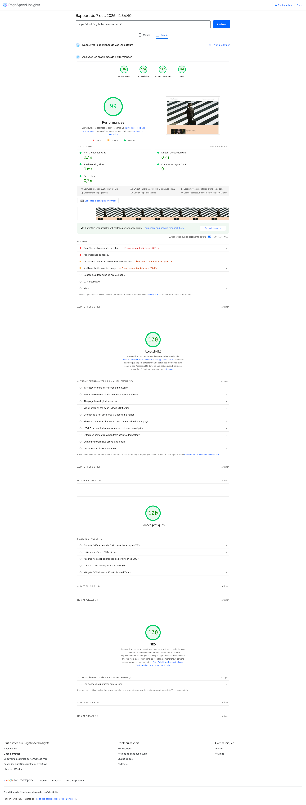

# Rapport d'Optimisation - Site Nina Carducci

## Performances ⚡

### Optimisation des Images 🖼️

- [x] Conversion de toutes les images aux formats nouvelle génération (WebP/AVIF)
- [x] Redimensionnement des images selon leur taille d'affichage réelle (économie : ~22 Mo)
- [x] Optimisation de la compression des images (gain : ~1,9 Mo)
- [x] Définition des attributs width et height pour toutes les images
- [x] Préchargement de l'image LCP et ajout du loading lazy sur les autres images
- [x] Implémentation d'images haute résolution pour les écrans Retina/4K (2x la taille affichée)
- [x] Mise en place d'images responsives avec les balises `picture` et `srcset`

### Optimisation du Code 💻

- [x] Suppression du CSS Bootstrap inutilisé via PurgeCSS
- [x] Minification des fichiers CSS et JavaScript
- [x] Nettoyage et optimisation de la structure CSS
- [x] Suppression des fichiers CSS obsolètes

### Refactorisation JavaScript 🔧

- [x] Retrait de jQuery et de la librairie Maugallery
- [x] Création d'un fichier gallery.js personnalisé
- [x] Restructuration du code JavaScript avec une architecture orientée objet (POO)

### Audit de Performance 📊

- [x] Génération de nouveaux rapports Lighthouse et GTmetrix

## Accessibilité ♿

### Structure et Sémantique HTML 🏗️

- [x] Ajout de l'attribut `lang="fr"` sur la balise `<html>`
- [x] Ajout d'attributs `alt` descriptifs pour toutes les images
- [x] Ajout d'attributs `for` sur les labels des formulaires
- [x] Vérification et correction de la sémantique des balises HTML
- [x] Vérification et correction de la hiérarchie des titres
- [x] Mise en place des balises structurelles `<header>`, `<main>` et `<footer>`

### Interface Utilisateur 🎨

- [x] Correction de la couleur du bouton actif pour la galerie

### Tests d'Accessibilité 🔍

- [x] Vérification de l'accessibilité avec l'outil WAVE

## SEO 🚀

### Métadonnées Techniques 🏷️

- [x] Repositionnement de la métabalise charset `UTF-8` en début de section `<meta>`
- [x] Ajout d'une balise `<title>` optimisée
- [x] Implémentation de métabalises de langue et de directives pour les robots

### Données Structurées et Réseaux Sociaux 🌐

- [x] Intégration de Rich Snippets au format JSON-LD
- [x] Ajout de métabalises Open Graph pour Facebook
- [x] Ajout de métabalises Twitter Card
- [x] Vérification et correction des ratios d'images pour les cartes Facebook et Twitter

### Validation et Prévisualisations ✅

- [x] Validation HTML avec le validateur W3C
- [x] Validation CSS avec le validateur W3C
- [x] Génération de prévisualisations des cartes réseaux sociaux
- [x] Ajout de prévisualisations des Rich Snippets

### Audit Final 🎯

- [x] Vérification complète du projet
- [x] Génération des audits finaux de performance, d'accessibilité et de SEO

### Rich Snippets

### Wave

### Lighthouse

_Ce rapport présente l'ensemble des optimisations techniques mises en œuvre pour améliorer les performances, l'accessibilité et le référencement du site Nina Carducci._
